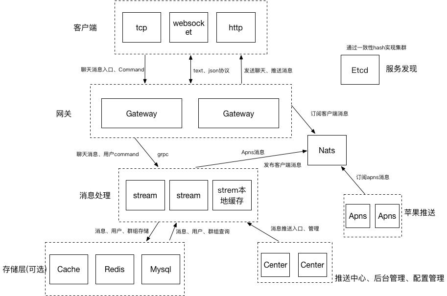

## 架构图

 

## 分布式解析

分布式分为有状态和无状态两种，数据库等存储服务一般都是有状态的，业务服务一般是无状态的。

有状态服务需要通过分布式算法来做一致性，无状态服务天生就是分布式的。

 

**Gateway**

&nbsp;&nbsp;Gateway是无状态的，因此可以任意水平扩展。

&nbsp;&nbsp;每个Gateway节点会将自身IP记录到Etcd中，客户端首先请求Gateway的Dispatch服务，
根据帐号的一致性Hash获取一个Gateway节点，然后直连ip。

!!!note 
    若不使用Dipatch服务，那么互斥登陆将不可用！

 

**Stream**

&nbsp;&nbsp;Stream因为涉及到缓存实现，因此是通过一致性Hash做的分布式，同时会通过一定的策略将数据同步到存储层(Mysql、Disk、Redis等)

&nbsp;&nbsp;Stream将自身IP打点到Etcd，Gateway和Center通过用户账号将消息通过一致性hash映射到指定的Stream节点上。

 

**Center**

&nbsp;&nbsp;Center是无状态的，因此可以任意水平扩展

 

**Apns**

&nbsp;&nbsp;Apns要管理和存储Token，这些都是在本地硬盘数据库完成的，具体的分布式使用方式参见Apns安装和启动章节

 

##存储层解析

**存储的选择**

&nbsp;&nbsp;我们的存储是使用了本地缓存 ＋ 持久化存储的方式，消息等首先是存在本地缓存，然后会定期或者通过某些操作触发后，同步到持久化存储。
根据业务场景，我们对持久化的存储有以下几个要求：
- 原生支持分布式
- 支持分布式事务
- 基于SQL
- 无需复杂的维护和管理
- 简单的数据迁移操作
- 后台可视化
- 开源产品不能过于守旧

&nbsp;&nbsp;根据以上要求，我们支持TiDB、Cockroach、Mysql数据库，但是推荐TiDB，在安装环节也是以TiDB作为示例

 

**存储的分布式**

&nbsp;&nbsp;TiDB和Cockroach天生支持分布式，Mysql需要通过mysql proxy等来做到这点，因此推荐前两个数据库

##使用的开源组件

**1.Etcd**

- 版本V3及以上
- 用来做服务发现和分布式
- 动态配置更新

**2.Nats**

- 最新版本
- 发送到客户端的消息: Stream发布到Nats,Gateway订阅
- Apns: Stream发布到Nats,Apns订阅

**3.TiDB**